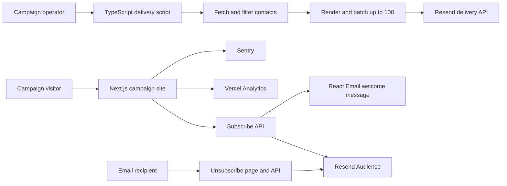

# Debbie for NCR

Production campaign website and email-delivery system for Debbie Maquidato's 2026 PNAA North Central Region vice-presidential campaign.

[](https://nextjs.org/)
[](https://www.typescriptlang.org/)
[](https://resend.com/)
[](https://sentry.io/)
[](https://vercel.com/)

**Live site:** [debbieforncr.com](https://debbieforncr.com)

**Portfolio case study:** [Christopher Pond](https://chrstphrpond.dev/lab/debbie-campaign)

## Overview

The project began as a mobile-first campaign page designed for QR traffic at nursing conferences. It grew into a campaign platform that combines the public site, supporter capture, transactional welcome emails, four branded campaign templates, bulk-delivery scripts, unsubscribe handling, analytics, and production monitoring.

The email program delivered **five campaign sends to 5,465 recipients**. Christopher Pond Maquidato built and maintained the product design, frontend, email system, deployment, and observability.

## What shipped

- Mobile-first campaign site built for QR-to-phone visits
- Structured leadership, clinical, academic, community, endorsement, and platform content
- Supporter signup through a Next.js route handler and Resend Audience
- Personalized React Email welcome and campaign templates
- Paginated audience retrieval and batch delivery in groups of up to 100
- Dry-run, preview-recipient, and send-limit controls for campaign scripts
- One-click web unsubscribe flow plus email unsubscribe headers
- UTM-tagged campaign links and scroll-depth analytics at 25%, 50%, 75%, and 100%
- Sentry error reporting, tracing, and replay sampling with default PII collection disabled
- Production deployment on Vercel with campaign assets stored in Vercel Blob

## System flow



## Technical decisions

### Mobile-first campaign experience

The main page uses Next.js App Router and React Server Components for composition. GSAP and Motion provide progressive animation, while the content remains usable when animation is unavailable. The visual system uses Plus Jakarta Sans, Instrument Serif, and the campaign's navy-and-crimson palette.

### Email delivery with operational controls

Campaign messages are written as typed React Email components. Delivery scripts retrieve contacts with cursor pagination, remove unsubscribed records, render personalized HTML, split recipients into batches of 100, throttle requests, and report sent and failed counts. Preview and dry-run options allow content and recipient checks before a live send.

### Subscription and consent handling

The subscribe route adds a supporter to a Resend Audience on a best-effort basis and sends a welcome email. The unsubscribe flow removes an address from the relevant audiences. Messages include unsubscribe headers, reply-to information, and campaign tags.

### Monitoring and analytics

Sentry covers browser, server, and edge errors. Production tracing is sampled, replays are prioritized for error sessions, and default visitor PII collection is disabled. Vercel Analytics records page traffic and explicit scroll-depth milestones.

## Technology

| Area | Tools |
| --- | --- |
| Application | Next.js 16, React 19, TypeScript |
| Styling and motion | Tailwind CSS 4, GSAP, Motion, shadcn/ui |
| Email | React Email, Resend |
| Monitoring | Sentry |
| Analytics | Vercel Analytics |
| Storage and hosting | Vercel Blob, Vercel |

## Project structure

```text
app/
  api/email/              Subscribe and unsubscribe endpoints
  unsubscribe/            Recipient-facing unsubscribe page
  page.tsx                Campaign page composition
components/               Campaign sections, forms, and analytics
emails/                   Welcome and broadcast React Email templates
scripts/                  Contact cleanup, asset upload, and delivery tools
lib/                      Campaign data, Resend client, and utilities
public/                   Campaign photography, logos, and favicons
```

## Local development

Requirements: Node.js 22 or later and pnpm.

```bash
pnpm install
pnpm dev
```

Open [http://localhost:3000](http://localhost:3000).

Preview the email templates separately:

```bash
pnpm email
```

Before committing changes:

```bash
pnpm lint
pnpm build
```

## Configuration

Provide secrets through the project secret manager or deployment platform. Never commit their values.

| Variable | Purpose |
| --- | --- |
| `RESEND_API_KEY` | Resend API authentication for subscriptions and delivery |
| `RESEND_AUDIENCE_ID` | Supporter audience used by subscribe and unsubscribe routes |
| `RESEND_VOTERS_AUDIENCE_ID` | Campaign audience included in unsubscribe requests |
| `RESEND_CAMPAIGN_SEGMENT_ID` | Recipient segment used by campaign delivery scripts |
| `NEXT_PUBLIC_SENTRY_DSN` | Client-side Sentry project connection |

Bulk email scripts can send real messages. Run their documented dry-run or preview mode before any live delivery, verify the selected audience, and inspect the rendered email.

## Privacy

Voter lists and contact exports are deliberately excluded from this repository and its history. The delivery tools accept private local input paths and omit recipient details from operational logs. Use sanitized or synthetic records for reviews, tests, and demonstrations.

## Status

The production site is live at [debbieforncr.com](https://debbieforncr.com). This repository documents the campaign website, email templates, sanitized delivery tooling, and technical architecture.
